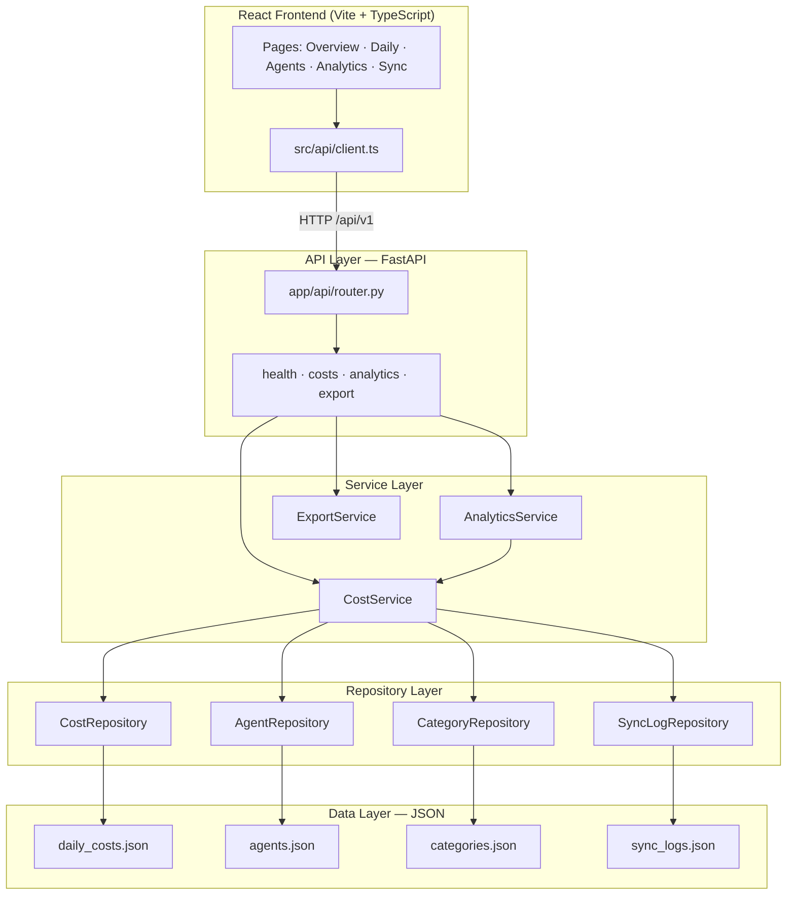

# AI Spend Dashboard

A **production-style full-stack cost control tower** for tracking AI voice and LLM infrastructure spend across multiple providers. Built as an original portfolio project with layered backend architecture, a multi-page React dashboard, scheduled sync jobs, and CSV export — all powered by synthetic demo data.

> No real API keys, billing accounts, or company endpoints. All figures are mock data for demonstration.

---

## Table of Contents

- [Features](#features)
- [Architecture](#architecture)
- [Project Structure](#project-structure)
- [Layer Responsibilities](#layer-responsibilities)
- [Quick Start](#quick-start)
- [Docker Deployment](#docker-deployment)
- [API Reference](#api-reference)
- [Frontend Pages](#frontend-pages)
- [Design Decisions](#design-decisions)

---

## Features

- **Multi-provider cost tracking** — OpenAI, Anthropic, ElevenLabs, Deepgram, telephony
- **INR + USD display** with configurable FX rate
- **KPI dashboard** — total spend, connected calls, cost-per-connected-call
- **Daily breakdown table** with per-provider splits and CPC metrics
- **Agent-level cost analysis** — calls, duration, booking rate by voice agent
- **Category breakdown** — LLM, TTS, ASR, telephony, analysis (pie chart)
- **Advanced analytics** — platform share, weekly rollups
- **Data sync pipeline** — scheduled + manual ingestion job logs
- **CSV export** — download daily cost report
- **Background scheduler** — APScheduler daily sync simulation

---

## Architecture



---

## Project Structure

```
ai-spend-dashboard/
├── backend/
│   ├── app/
│   │   ├── main.py                 # App factory, CORS, APScheduler lifespan
│   │   ├── core/
│   │   │   ├── config.py           # Pydantic settings (FX rate, CORS, data dir)
│   │   │   └── database.py         # JsonStore abstraction
│   │   ├── models/
│   │   │   └── schemas.py          # Pydantic request/response models
│   │   ├── repositories/
│   │   │   └── cost_repository.py  # Cost, agent, category, sync log repos
│   │   ├── services/
│   │   │   ├── cost_service.py     # Cost enrichment, summary, sync triggers
│   │   │   ├── analytics_service.py # Platform breakdown, weekly rollups
│   │   │   └── export_service.py   # CSV generation
│   │   └── api/
│   │       ├── router.py
│   │       └── routes/             # health, costs, analytics, export
│   ├── data/                       # JSON mock datasets
│   ├── requirements.txt
│   └── Dockerfile
├── frontend/
│   ├── src/
│   │   ├── api/client.ts           # Typed API client
│   │   ├── types/index.ts
│   │   ├── components/Layout.tsx   # Sidebar navigation shell
│   │   └── pages/                  # Dashboard, DailyCosts, Agents, Analytics, SyncLogs
│   ├── package.json
│   ├── vite.config.ts              # Dev proxy → backend :8001
│   └── Dockerfile
├── docker-compose.yml
└── README.md
```

---

## Layer Responsibilities

| Layer | Responsibility |
|-------|----------------|
| **Presentation** | React SPA with Recharts visualizations, routing, typed API client |
| **API** | HTTP routing, query param validation, response serialization |
| **Service** | Business logic: INR conversion, CPC calculation, analytics aggregation, sync orchestration |
| **Repository** | Data access abstraction over JSON files; swappable for DB in production |
| **Data** | Mock billing datasets representing multi-provider AI spend |

---

## Quick Start

### Backend

```bash
cd backend
pip install -r requirements.txt
uvicorn app.main:app --reload --port 8001
```

API docs: http://localhost:8001/docs

### Frontend

```bash
cd frontend
npm install
npm run dev
```

Dashboard: http://localhost:5174

---

## Docker Deployment

```bash
docker compose up --build
```

| Service | URL |
|---------|-----|
| Frontend | http://localhost:5174 |
| Backend API | http://localhost:8001/docs |

---

## API Reference

| Method | Path | Description |
|--------|------|-------------|
| GET | `/api/v1/health` | Health check |
| GET | `/api/v1/costs/summary` | Aggregate KPIs (INR + USD) |
| GET | `/api/v1/costs/daily?from=&to=` | Daily cost rows with CPC |
| GET | `/api/v1/costs/categories` | Category breakdown |
| GET | `/api/v1/costs/agents` | Agent-level cost metrics |
| GET | `/api/v1/costs/platforms/{p}/trends` | Per-platform time series |
| GET | `/api/v1/costs/sync-logs` | Sync job history |
| POST | `/api/v1/costs/sync/{source}` | Trigger manual sync |
| GET | `/api/v1/analytics/platform-breakdown` | Provider share analysis |
| GET | `/api/v1/analytics/weekly-rollup` | Weekly spend aggregation |
| GET | `/api/v1/export/daily.csv` | CSV export |

---

## Frontend Pages

| Route | Page | Description |
|-------|------|-------------|
| `/` | Overview | KPI cards, stacked bar chart, category pie chart |
| `/daily` | Daily Costs | Full breakdown table + CSV export link |
| `/agents` | Agents | Per-agent cost, duration, booking rate |
| `/analytics` | Analytics | Platform share + weekly rollup |
| `/sync` | Sync Logs | Ingestion pipeline logs + manual trigger |

---

## Design Decisions

1. **JSON persistence** — Keeps the demo self-contained with zero DB setup; repository pattern makes migration to PostgreSQL/BigQuery straightforward.
2. **Dual currency** — Mirrors real enterprise dashboards that display INR for finance teams while ingesting USD-denominated API bills.
3. **Separate analytics service** — Platform breakdown and weekly rollups are independent of raw cost CRUD, matching how production cost towers separate ingestion from reporting.
4. **APScheduler** — Simulates nightly billing sync jobs without requiring external cron infrastructure.
5. **React + Recharts** — Multi-page SPA with charting matches the complexity of internal cost reporting tools.

---

## Skills Demonstrated

- Full-stack dashboard development (FastAPI + React + TypeScript)
- Layered / clean architecture (API → Service → Repository → Data)
- Multi-provider cost analytics and KPI design
- Background job scheduling
- Data export pipelines
- Docker multi-container deployment

---

## License

MIT — portfolio and educational use.
